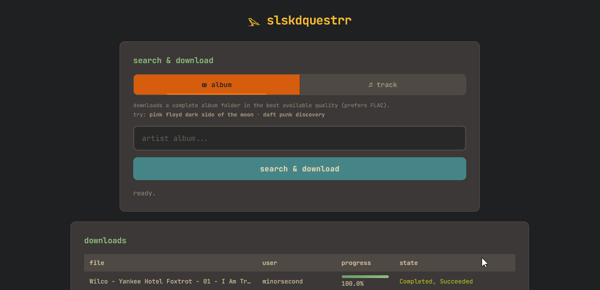

# 𓅪 slskdquestrr

A self-hosted web UI for requesting music downloads through
[slskd](https://github.com/slskd/slskd) (Soulseek).  
Search by **album** or **track**, and slskdquestrr automatically picks
the quality source (prefers FLAC) and queues the download. No
need to touch the slskd interface.




---

## Features

| | |
|---|---|
| 🎵 **Album & Track modes** | Full-album folders or single best-quality files |
| 🏆 **Smart scoring**       | Ranks results by format, bitrate, relevance, queue length |
| 🔒 **No CORS headaches**   | Built-in nginx reverse-proxy to the slskd API |

---

## Prerequisites

| Requirement | Notes |
|---|---|
| **Docker** & **Docker Compose** | Version 2+ recommended |
| **slskd** | Running instance with an API key configured |
| _**gluetun** (Optional)_ | _VPN container_ |


---

## Environment Variables

| Variable | Required | Default | Description |
|---|---|---|---|
| `SLSKD_BASE_URL` | ✅ | `http://server_ip_address:5030` | Internal URL of your slskd instance |

> **Note:** `SLSKD_BASE_URL` should be the Docker-internal URL (no trailing slash) _**OR**_ the server's IP.  
> If slskd uses `network_mode: service:gluetun`, use `http://gluetun:5030`.

---

## Deployment

### Option A — Add to an existing Docker Compose stack

Add this service to your `docker-compose.yml`:

```yaml
services:
  slskdquestrr:
    image: ghcr.io/rj45connector/slskdquestrr:latest
    container_name: slskdquestrr
    ports:
      - "8082:80"
    environment:
      - SLSKD_BASE_URL=http://server_ip_address:5030      # or server_ip_address, http://gluetun:5030 (If using a VPN)
    restart: unless-stopped
```

Then:

```bash
docker compose up -d slskdquestrr
```

### Option B — Build from source

```bash
git clone https://github.com/rj45connector/slskdquestrr.git
cd slskdquestrr

# Edit docker-compose.yml with your server's IP

docker compose up -d --build
```

### Access

Open **http://YOUR_SERVER_IP:8082** in your browser.

---

This WebUI uses slskd web UI credentials to authenticate. Please ensure you have a strong username/password conmanation if exposing these services. 

---

## Customisation

### Tuning the search algorithm

Edit `public/index.html` and adjust the `CFG` object:

| Parameter | Default | Effect |
| :--- | :--- | :--- |
| **General & API** | | |
| `API_BASE` | `'/api/v0'` | The base URL endpoint for API requests |
| `PER_PAGE` | 15 | Number of items displayed per page in the UI |
| **Search & Polling** | | |
| `POLLS` | 24 | Maximum number of times to check for search results |
| `DELAY` | 2500 | Milliseconds to wait between search polls |
| `MIN_TRACKS` | 4 | Minimum number of files for a folder to qualify as an "album" |
| `REL_GATE` | 0.45 | Minimum relevance score (0–1) required for a result to be considered |
| `MIN_KBPS` | 128 | Minimum bitrate threshold for audio files |
| **Scoring Weights** | | |
| `W_REL` | 200 | Multiplier/weight for the relevance of a result |
| `W_FLAC` | 100 | Bonus points added for FLAC (lossless) sources |
| `W_320` | 65 | Bonus points for 320kbps MP3 files |
| `W_256` | 45 | Bonus points for 256kbps MP3 files |
| `W_192` | 30 | Bonus points for 192kbps MP3 files |
| `W_LOW` | 8 | Small bonus points for low-bitrate files |
| `W_TRACK` | 3 | Points added for every matching track found |
| `W_TRACK_CAP` | 45 | Maximum total bonus points allowed from track counts |
| `W_SLOT` | 25 | Bonus points awarded if the user has available upload slots |
| `W_Q_PEN` | 0.4 | Penalty multiplier applied based on the length of the user's queue |
| `W_Q_CAP` | 25 | The maximum penalty points that can be deducted for queue length |
| `W_NOISE` | 90 | Filtering threshold to ignore "noisy" or low-quality result matches |
| **Exit Conditions** | | |
| `ALBUM_EXIT_REL` | 0.75 | Stop searching if an album's relevance reaches this threshold |
| `ALBUM_EXIT_SCORE`| 280 | Stop searching if an album's total score reaches this value |
| `ALBUM_EXIT_FILES`| 6 | Minimum files required to trigger the album exit logic |
| `ALBUM_EXIT_POLL` | 6 | Minimum number of polls to complete before exiting early |
| `TRACK_EXIT_REL` | 0.7 | Stop searching if a single track's relevance reaches this threshold |
| `TRACK_EXIT_SCORE`| 240 | Stop searching if a single track's score reaches this value |
| `TRACK_EXIT_POLL` | 4 | Minimum polls to complete before exiting search for a track |
| **Retries & Monitoring**| | |
| `RETRY` | 5 | Total number of retry attempts for failed requests |
| `RETRY_MS` | 12000 | Milliseconds to wait before initiating a retry |
| `RETRY_POLL` | 1500 | Polling frequency (ms) while in a retry state |
| `WATCH_GRACE` | 90000 | Milliseconds to wait before a "watched" download is considered stalled |
| `WATCH_MAX` | 3 | Maximum number of concurrent downloads to actively monitor |
| `WATCH_POLL` | 10000 | Frequency (ms) at which the download watcher checks status |
| `MON_MS` | 2500 | General monitoring/refresh interval for the system |

### Theming

All colours use CSS custom properties.  
Edit the `:root` block in `public/index.html` to reskin.

---

## Health Check

```bash
curl http://localhost:8082/health
# OK
```

---

## License

MIT — do whatever you want.

---

## Quick Start — Build & Run

```bash
# 1.) Clone & create the repo
mkdir slskdquestrr && cd slskdquestrr

# 2.) Create the folder structure
mkdir -p public nginx

# 3. Place the files:
#    public/index.html          
#    nginx/default.conf.template 
#    entrypoint.sh              
#    Dockerfile                 

# 4.) Make entrypoint executable
chmod +x entrypoint.sh

# 5.) Build the image
docker build -t slskdquestrr:latest .

# 6.) Test it standalone
docker run --rm -p 8082:80 \
  -e SLSKD_BASE_URL=http://host.docker.internal:5030 \
  slskdquestrr:latest

# 7.) Open http://localhost:8082
```
---
## But like, how does it work? 

| Piece | Purpose |
|---|---|
| `Dockerfile` | Builds a ~7 MB `nginx:alpine` image with the frontend baked in |
| `entrypoint.sh` | At startup: generates `/config.js` from env vars, processes the nginx template, starts nginx |
| `config.js` (generated) | Passes `SLSKD_API_KEY` and `API_BASE` to the browser JS at runtime — no rebuild needed to change config |
| `default.conf.template` | Nginx serves the HTML at `/` and proxies `/api/v0/*` → slskd — eliminates CORS entirely |
| `index.html` | Reads connection info from `window.SLSKD_CONFIG` (loaded via `config.js`) instead of hard-coding it |

> **Security note:** Your Bearer Token is visible via HTTP. This is acceptable for a private, self-hosted tool behind your LAN/VPN. Do **not** expose port 8082 to the public internet without additional authentication (e.g., Authelia, Authentik, or HTTP basic auth in nginx).
